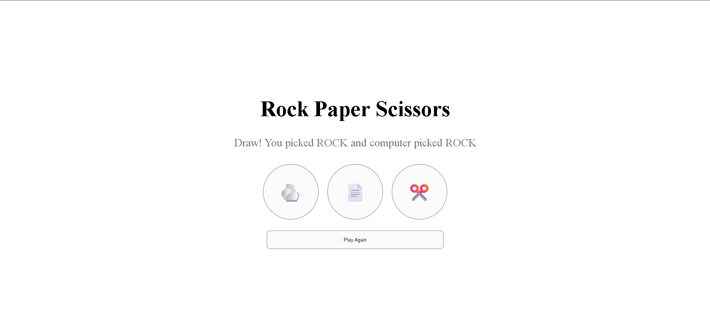
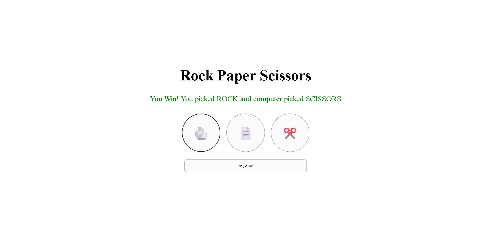
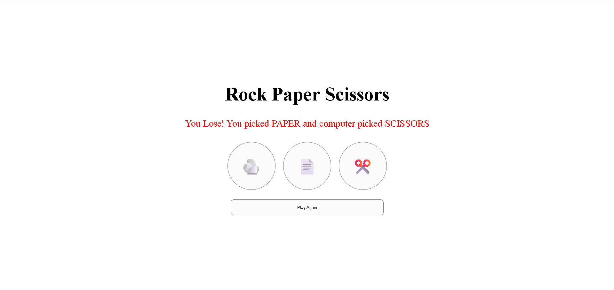

# Rock Paper Scissors

## Technologies Used

- HTML
- CSS
- Javascript
- Git and Github

## Description

Rock Paper Scissors is a simple web game where you choose Rock, Paper, or Scissors and play against the computer. The computer makes a random choice, the app compares both choices, and it displays whether you win, lose, or draw.

This implementation uses [index.html](index.html) for structure, [style.css](style.css) for layout and styling, and [app.js](app.js) for game logic.

## Features

- Clickable Rock, Paper, and Scissors buttons
- Random computer choice on each round
- Win, lose, and draw result detection
- Result displayed with color feedback: green for win, red for loss, grey for draw
- Play Again button to reset the result and start a new round

## User Stories

- As a user, I want to choose Rock, Paper, or Scissors so I can play the game.
- As a user, I want the computer to choose randomly so the game feels fair.
- As a user, I want the app to display the result so I know whether I won, lost, or drew.
- As a user, I want the result to show both my choice and the computer choice so the outcome is clear.
- As a user, I want a Play Again button so I can start a new round quickly.

## Screenshots

## Future Enhancements

- Add a score tracker for multiple rounds.
- Add sound effects and animations.
- Add keyboard controls for faster play.
- Add a game rules section for new users.

## Credits

- Mr. Omar Kamal (https://github.com/omarakamal)
- Mr. Zaid (https://github.com/justzaid)
- Mrs. Israa Ashoor (https://github.com/ISRAA-ASHOOR)

